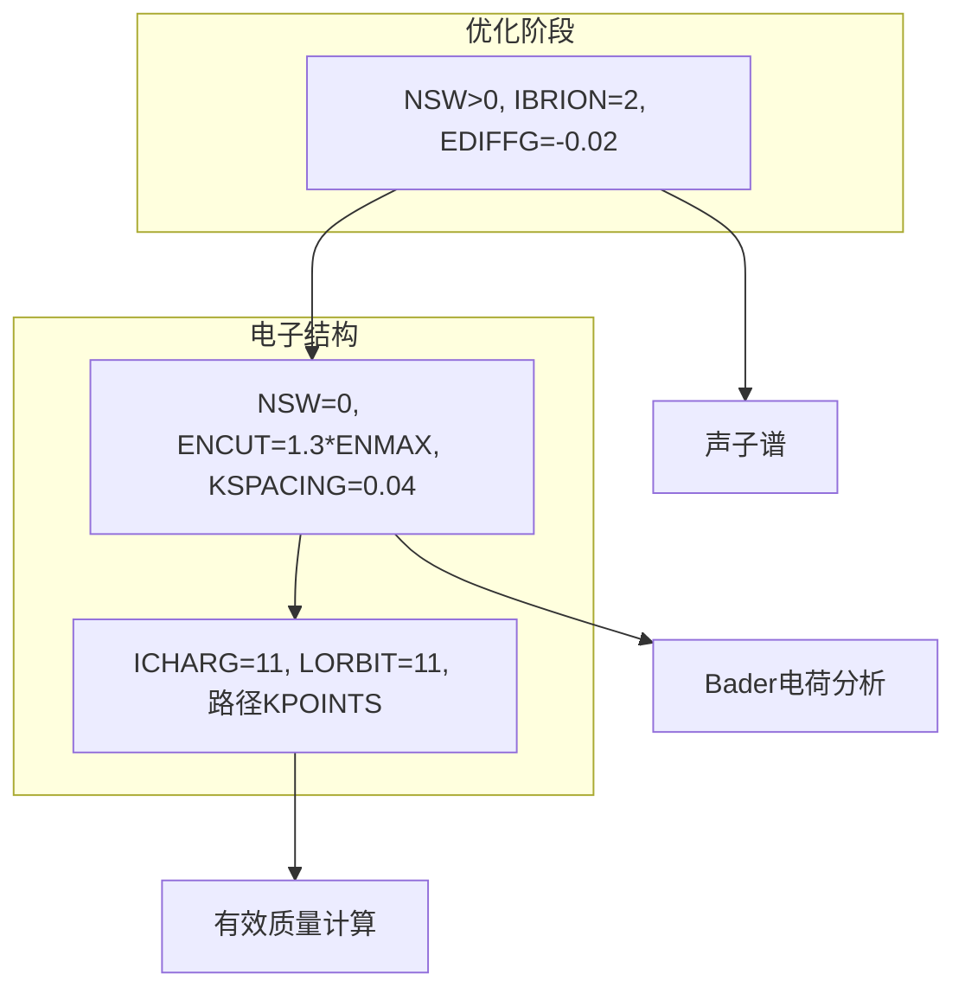
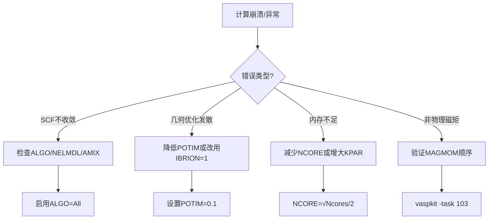

# 计算原理
# Generated by Kimi-K2
VASP 的计算原理可以拆成两条主线：  
A. 如何把“电子结构问题”变成“计算机能求解的矩阵本征值问题”；  
B. 如何把“原子核运动”与“电子结构”耦合起来，给出宏观可观测的能量、力、张量等。  
下面按“从量子力学出发 → 离散 → 自洽 → 离子步 → 输出”五大阶段，一步步展开，并指出 VASP 在每个阶段用到的关键词、文件与数学表达式。读完即可把“ INCAR 里那些关键词”与“底层物理/数值算法”一一对应。

------------------------------------------------
0 物理模型与三大近似（还没写代码就先做掉的近似）
------------------------------------------------
1. Born–Oppenheimer 近似  
   核质量 ≫ 电子质量 ⇒ 把核坐标 ${R_I}$ 看成“外部参数”，电子在瞬时核势下运动。  
   ⇒ VASP 主程序流程就是“固定核 → 解电子 → 算力 → 挪核”循环。

2. 周期性边界条件 ⇒ 用 Bloch 定理  
   单电子波函数  
   $$\psi_{nk}(r) = e^{ik·r} u_{nk}(r),  u_{nk}(r)=u_{nk}(r+R)$$  
   只需在“一个原胞”内求解 $u_{nk}(r)$，$k$ 取第一布里渊区 (IBZ) 的离散网格 ⇒ KPOINTS 文件。

3. 密度泛函理论 (DFT)  
   把多电子基态能量写成  
   $$E[n] = T_s[n] + E_H[n] + E_{ext}[n] + E_{xc}[n]$$  
   其中 $n(r)$ 是电子数密度，$T_s$ 是无相互作用动能，$E_H$ 是 Hartree，$E_{xc}$ 是交换-关联。  
   ⇒ 得到单电子 Kohn–Sham (KS) 方程  
   $$\left[ − \frac{1}{2} ∇² + V_{eff}(r) \right] \psi_{nk}(r) = \epsilon_{nk} \psi_{nk}(r)$$  
   $V_{eff} = V_{ion} + V_H + V_{xc}$  
   目标：自洽求出 $n(r) = \sum_{occ} |\psi_{nk}(r)|²$。

------------------------------------------------
1 把 KS 方程“离散化”——平面波基组
------------------------------------------------
1. 平面波展开  
   $$u_{nk}(r) = \sum_G C_{nk}(G) e^{iG·r}$$  
   倒格矢 $G$ 截断到 $|k+G|² ≤ E_{cut}$ ⇒ ENCUT 参数。  
   能量收敛 $∝ 1/E_{cut}³$，ENCUT 越大基组越完备，但计算量 $∝ N_{pw} \log N_{pw}$。

2. 赝势 (PP) 与 PAW  
   靠近核的 1s/2s/2p 等“芯电子”不参与化学键 ⇒  
   - 模守恒赝势 (NC-PP) 或  
   - 超软赝势 (US-PP, Vanderbilt) 或  
   - 投影缀加波 (PAW, Blöchl)  
   VASP 默认用 PAW：  
   - 价电子仍用平面波展开；  
   - 在“ augmentation region ”(核附近小球) 内用原子基 $φ_i$ 补回真实节点。  
   ⇒ POTCAR 里保存：  
     - 每个元素的参考电子组态  
     - 部分波 $φ_i$、投影算符 $p_i$、补偿电荷密度  
   ⇒ 能量最终写成  
   $$E = \sum_{nk} f_{nk} \langle\psi_{nk}| −½∇² |\psi_{nk}\rangle  
      + E_H[n] + E_{xc}[n]  
      + E_{ion-ion}(\text{Madelung})  
      + E_{PAW}(\text{augmentation})$$  
   所有“芯电子效应”藏在 $E_{PAW}$ 里，用户只需把价电子当平面波处理。

------------------------------------------------
2 自洽场 (SCF) 循环——电子步
------------------------------------------------
1. 初始猜测  
   ICHARG=2 ⇒ 原子电荷叠加 (superposition of atomic charges)  
   ICHARG=1 ⇒ 读入上一步 CHGCAR  

2. 构造初始 $V_{eff}(r)$  
   - 离子局域势 $V_{ion}^{PP}(r)$ 来自 POTCAR  
   - 初始 $n(r)$ ⇒ 求 Hartree $V_H(r) = \int \frac{n(r')}{|r–r'|} dr'$  
   - 选交换-关联泛函：  
     LDA(PZ, PW)、GGA(PBE, RPBE, PBEsol)、meta-GGA( SCAN, R2SCAN )、杂化(HSE06, PBE0) ⇒ 对应 INCAR 中 GGA、LHFCALC、AEXX 等关键词。  
   - 得到 $V_{eff} = V_{ion} + V_H + V_{xc}$

3. 对角化 KS 哈密顿  
   平面波基下 $H$ 矩阵元  
   $$H_{G,G'} = \frac{1}{2} |k+G|² δ_{GG'} + V_{eff}(G−G')$$  
   维数 = $N_{pw} ≈ 100–200 ×$ 原子数，直接对角化 $O(N³)$ 不可行 ⇒  
   - 迭代对角化：Davidson / RMM-DIIS (ALGO=Normal/Fast/All)  
   - 块算法：一次求 NBANDS 个最低本征值。  
   输出：  
   - 本征值 $ε_{nk}$ (写入 EIGENVAL)  
   - 波函数系数 $C_{nk}(G)$ (二进制 WAVECAR)

4. 计算新电荷密度  
   $$n_{new}(r) = \sum_{nk} f_{nk} |\psi_{nk}(r)|²$$  
   占据数 $f_{nk}$ 由费米-狄拉克 smearing 决定：  
   - ISMEAR=0 → 高斯展宽 $σ=$SIGMA  
   - ISMEAR=1…N → Methfessel-Paxton  
   - ISMEAR=-5 → 四面体法(绝缘体推荐)  
   金属体系需要足够密的 k 网格 + 展宽 → 收敛到 0 K 外推能量。

5. 混合 (Mixing)  
   简单线性混合 $n_{in} = α n_{new} + (1−α) n_{old}$ 易振荡 ⇒  
   - Pulay/Thomas-Fermi 混合：  
     用前 $m$ 步的残差 $R_i = n_i − n_i^{out}$ 构造最小残差向量，  
     对应 INCAR 关键词 AMIX, BMIX, AMIX_MAG, BMIX_MAG, WC。  
   - 电荷密度 + 势能混合 (Mixing=1/2/4)  
   - 磁性体系额外对自旋密度做独立混合。

6. 收敛判据  
   $|E_n − E_{n−1}| < \text{EDIFF}$ (默认 1e-4 eV)  
   或 密度残差 $\int|R(r)|dr$ < 1e-6  
   未收敛 → 回到步骤 3；收敛 → 输出 CHGCAR、WAVECAR。

------------------------------------------------
3 离子运动——分子动力学/结构优化
------------------------------------------------
BO 近似下总能量 $E_{tot}(\{R_I\})$ 已得到，则  
力 $$F_I = −\frac{dE_{tot}}{dR_I} \quad (\text{Hellmann–Feynman} + \text{Pulay 修正})$$  
应力 $$σ_{ab} = \frac{1}{Ω} \frac{∂E}{∂ε_{ab}}$$

VASP 提供几种“如何挪核”算法：  
- IBRION=1 → 准牛顿 (Davidson)  
- IBRION=2 → 共轭梯度 (CG)  
- IBRION=3 → 阻尼分子动力学 (damped MD)  
- IBRION=0 → 正式分子动力学 (NVT/NVE)  
对应参数：  
  POTIM → 步长 (Å 或 fs)  
  NSW → 最大步数  
  EDIFFG → 力收敛阈值 (eV/Å)  

离子步外层循环：  
1. 固定核做 SCF → 得能量 & 力  
2. 若 $\max|F_I| < \text{EDIFFG}$ ⇒ 结束，输出 CONTCAR  
3. 否则按选定的 IBRION 算法更新 $${R_I}$$ → 新 POSCAR → 回第 1 步

------------------------------------------------
4 进阶功能：DFT+U、自旋轨道、非共线、杂化
------------------------------------------------
1. DFT+U (LDAU=.TRUE.)  
   对局域 d/f 轨道加 Hubbard U：  
   $V_{eff}$ 额外项 $V_U = U(½−n_m) |φ_m\rangle\langle φ_m|$  
   通过旋转不变形式 (Dudarev) 实现：$E_U = \frac{U−J}{2} \text{Tr}[ρ−ρ²]$  
   需要定义：LDAUL, LDAUU, LDAUJ, 以及增强混合 LMAXMIX=4/6。

3. 自旋轨道耦合 (LSORBIT=.TRUE.)  
   在 PAW  augmentation 区加入 $ξ \mathbf{L}·\mathbf{S}$ 项，  
   哈密顿变成 2×2 分块 (上/下自旋) ⇒ 非共线 MAGMOM 需给三维向量 $(m_x,m_y,m_z)$。  
   必须关闭对称性 ISYM=0，k 网格需更密。

4. 杂化泛函 (HSE06, PBE0)  
   把交换能分成短程/长程：  
   $$E_x = α E_x^{\text{exact,SR}}(μ) + (1−α) E_x^{\text{PBE,SR}}(μ) + E_x^{\text{PBE,LR}}(μ)$$  
   实现方式：在 SCF 循环里用 WAVECAR 计算 100% 精确交换势，  
   计算量 ↑ 10–50 倍，NKRED 可降 k 网格加速。

5. 非绝热 & GW & BSE  
   VASP 也支持 GW 准粒子修正、BSE 激子、rt-TDDFT 等，但主线仍是“DFT-SCF → 响应性质”。

------------------------------------------------
5 输出文件与后处理
------------------------------------------------
- OUTCAR：每一步能量、力、应力、磁矩、收敛残差  
- OSZICAR：电子步迭代简表 (dE, dRho)  
- CHGCAR：自洽三维电荷密度 $n(r)$ (格点表示)  
- WAVECAR：平面波系数 $C_{nk}(G)$ (二进制，大)  
- EIGENVAL：$ε_{nk}$ 列表，供画能带  
- DOSCAR：总/投影态密度  
- PROCAR：轨道分辨投影 $\langle φ_i|ψ_{nk}\rangle$，LORBIT=11 时生成  
- CONTCAR：优化后的离子位置 ⇒ 可直接当新 POSCAR

------------------------------------------------
6 完整计算流程图（把上面所有阶段串起来）
------------------------------------------------
```
读入 POSCAR POTCAR KPOINTS INCAR
        ↓
生成初始电荷  (ICHARG)
        ↓
构造 V_eff    (PREC, ENCUT, GGA, LDAU, LSORBIT …)
        ↓
SCF 循环      (ALGO, AMIX, EDIFF, NELM …)
        ↓
得能量 & 力   (CHGCAR WAVECAR)
        ↓
EDIFFG 检查   (IBRION, POTIM, NSW)
        ↓
是 → 结束，写 CONTCAR
否 → 更新核坐标 → 回 SCF
```

------------------------------------------------
7 小结：把“关键词”与“物理/数值”一一对应
------------------------------------------------
- ENCUT        ↔ 平面波基组大小  
- PREC         ↔ FFT 网格密度 & 补偿电荷精度  
- ICHARG/CHGCAR ↔ 初始/自洽电荷  
- ALGO/AMIX    ↔ 对角化 & 混合算法  
- ISPIN/MAGMOM ↔ 自旋极化初始构型  
- LDAU/LDAUTYPE ↔ 对 d/f 轨道的 Hubbard 修正  
- LSORBIT      ↔ 加入 $\mathbf{L}·\mathbf{S}$ 耦合，非共线  
- IBRION/POTIM/EDIFFG ↔ 离子放松算法与收敛标准  
- KPOINTS      ↔ 布里渊区积分离散化  
- POTCAR       ↔ 赝势/PAW 数据，决定“哪些电子是价电子”

把这张对照表放在手边，再看任何 INCAR 示例，都能立即知道它背后对应的是哪一步数值算法、哪一层物理近似。至此，VASP 计算原理的“完整地图”就铺开了，剩下的只是根据体系特征调节参数、做收敛测试、解读输出。祝计算顺利!

## VASP对磁矩的处理
在 VASP 里，“磁矩”并不是一步算完的，而是**分三条链**同步处理：

1. 输入链——告诉程序“我怀疑这个原子有多少未配对电子”；
2. 自洽链——在每一次电子迭代里，把自旋自由度当成**两套独立（或非共线）的 KS 方程**求解，并实时更新自旋密度；
3. 输出链——自洽结束后，把自旋密度在原子球里积分，得到我们打印在 OUTCAR 里的“磁矩”。

下面把三条链拆开讲，并给出对应 INCAR 关键词、数学公式和后处理命令。

------------------------------------------------
1. 输入链：初始磁矩怎么“塞”进去
------------------------------------------------
- 共线（collinear）ISPIN=2  
  只在 z 方向有自旋，电子密度分成“自旋向上 n↑(r)”和“自旋向下 n↓(r)”两套。  
  初始猜测通过 MAGMOM 给出每个原子的 **n↑–n↓** 估值（单位 μB）：

  ```
  MAGMOM = 6*3.0 6*-3.0   # 12 个原子，前 6 个↑3 μB，后 6 个↓3 μB
  ```

  程序内部把该数值转换成 **初始自旋密度**：

  $$
  n_{\text{init}}^\uparrow(r)   = \frac12 n_{\text{atom}}(r) + \frac12 \sum_I M_I^{\text{MAGMOM}} \cdot w_I(r),
  $$
  $$
  n_{\text{init}}^\downarrow(r) = \frac12 n_{\text{atom}}(r) - \frac12 \sum_I M_I^{\text{MAGMOM}} \cdot w_I(r),
  $$

  其中 $w_I(r)$ 是原子高斯形状函数，仅用于“起步”，不会严格影响最终自洽结果，但**好的初值可让 SCF 少走很多步**。

- 非共线（non-collinear）LNONCOLLINEAR=.TRUE.  
  每个原子要给 **三维向量** (mx, my, mz)；MAGMOM 写法：

  ```
  MAGMOM = 3*2.2 0 0 1  # 3 个原子，第 1 个 2.2 μB 沿 x，其余 0
  ```

  内部把自旋密度变成 **2×2 厄米矩阵**：

  $$
  \rho_{\sigma\sigma'}(r) = \frac12 n(r)\,I + \frac12 \mathbf{m}(r)\cdot\boldsymbol{\sigma},
  $$

  其中 $\boldsymbol{\sigma}=(\sigma_x,\sigma_y,\sigma_z)$ 是 Pauli 矩阵。  
  此时 KS 方程也扩成 **2×2 块矩阵**，每 k 点求解 **两套复函数**（spinor）。

- 随机初值（可选）  
  若把 MAGMOM 整行删掉，VASP 会按“原子电荷 * 0.7”给一个小随机值；对反铁磁体系强烈建议**手动指定**否则容易掉进亚稳态铁磁解。

------------------------------------------------
2. 自洽链：SCF 里如何“更新”磁矩
------------------------------------------------
共线情形（ISPIN=2，LNONCOLLINEAR=.F.）
++++++++++++++++++++++++++++++++++++
1. 向上/向下电子各有一套 KS 哈密顿：

   $$
   \hat H^\uparrow   = -\frac12\nabla^2 + V_{\text{eff}}[n^\uparrow,n^\downarrow],
   $$
   $$
   \hat H^\downarrow = -\frac12\nabla^2 + V_{\text{eff}}[n^\downarrow,n^\uparrow].
   $$

   注意 $V_{\text{eff}}$ 里包含  
   - Hartree（自旋相加 $n=n^\uparrow+n^\downarrow$）  
   - 交换-关联（自旋分开 $n^\uparrow,n^\downarrow$）  
   - 外加 LDA+U 或 PAW 补偿项。

2. 每次迭代分别对角化 $H^\uparrow$, $H^\downarrow$ → 得 $\psi_{nk}^\uparrow$, $\psi_{nk}^\downarrow$  
   → 新占据数 $f_{nk}^\uparrow$, $f_{nk}^\downarrow$ → 新密度

   $$
   n^\uparrow_{\text{new}}(r) = \sum_{nk} f_{nk}^\uparrow |\psi_{nk}^\uparrow(r)|^2,
   $$
   $$
   n^\downarrow_{\text{new}}(r) = \sum_{nk} f_{nk}^\downarrow |\psi_{nk}^\downarrow(r)|^2.
   $$

3. 混合器（AMIX, BMIX）把 **自旋密度差** $\Delta n = n^\uparrow - n^\downarrow$ 与 **总电荷** $n = n^\uparrow + n^\downarrow$ **分开混合**；磁性体系通常要给更小的 AMIX_MAG（0.2–0.4）以保证稳定。

非共线情形（LNONCOLLINEAR=.TRUE.）
++++++++++++++++++++++++++++++++++++
1. 哈密顿变成 **2×2 矩阵算符**：

   $$
   \hat H = \left( -\frac12\nabla^2 + V_{\text{eff}} \right) I_{2\times2}
            + \mathbf{B}_{\text{xc}}(r)\cdot\boldsymbol{\sigma},
   $$

   其中 $\mathbf{B}_{\text{xc}}(r)=\delta E_{\text{xc}}/\delta \mathbf{m}(r)$ 是交换-关联场，方向随位置变化。

2. 对角化得到 **二维 spinor** $\psi_{nk}(r)=\bigl(\psi_{nk}^+(r),\psi_{nk}^-(r)\bigr)^T$；  
   新的 **矢量自旋密度**：

   $$
   \mathbf{m}(r) = \sum_{nk} f_{nk}\,
                   \psi_{nk}^\dagger(r)\,\boldsymbol{\sigma}\,\psi_{nk}(r).
   $$

3. 自洽收敛后，**每个原子球**内积分：

   $$
   \mathbf{M}_I = \int_{\text{PAW sphere}_I} \mathbf{m}(r)\,dr
   $$

   就是 OUTCAR 末尾打印的 **“magnetization (x,y,z)”**。

------------------------------------------------
3. 输出链：把“自旋密度”变成“磁矩”数字
------------------------------------------------
共线版本
++++++++
OUTCAR 会看到

```
magnetization (x)   0.0000
magnetization (y)   0.0000
magnetization (z)   24.567
```

这是把 $n^\uparrow - n^\downarrow$ 在整个晶胞积分，再按 **Bohr magneton μB** 换算：  
$$M_{\text{cell}} = \int \bigl(n^\uparrow(r)-n^\downarrow(r)\bigr)\,dr \times \mu_B.$$  
下方还会给出 **“absolute magnetization”** = $\int |n^\uparrow - n^\downarrow| dr \times \mu_B$，用来判断是否是反铁磁（净矩小，绝对矩大）。

非共线版本
+++++++++
OUTCAR 末尾列出每个原子的 **(mx, my, mz)** 和总向量：

```
tot magnetization (x,y,z) =   0.123  0.000  2.456
total moment = 2.459
```

单位同样是 μB。  
若开了 SOC（LSORBIT=.TRUE.），还会打印 **“ orbital moment ”**（通过 PAW 计算 $\langle L_z \rangle$）。

------------------------------------------------
4. 后处理：提取、可视化、旋转
------------------------------------------------
- 命令行快速看  
  ```
  grep "magnetization" OUTCAR | tail -10
  ```

- 分原子导出  
  vaspkit → 任务 503/504 可直接写 **MAGMOM.xsf** 或 **magmom.dat**，一列原子一列 (mx,my,mz)。

- 旋转量化轴（非共线 + SOC）  
  若要把默认 z 轴换到任意方向 **u**，只需改  
  ```
  SAXIS = u_x u_y u_z   （归一化）
  ```
  内部会做一次规范旋转：$\psi' = e^{-i\theta\mathbf{n}\cdot\boldsymbol{\sigma}/2}\psi$，自洽后得到的 **m** 就是相对于 **u** 轴的分量。

------------------------------------------------
5. 常见疑问速答
------------------------------------------------
1. “初始 MAGMOM 必须精确吗？”  
   不需要，但应给出 **正确反铁磁序** 或 **铁磁量级**。差太多会导致 SCF 震荡或掉进亚稳态。

2. “MAGMOM 会改变最终能量吗？”  
   不改变 **基态能量**，但改变 **收敛路径** 和 **能否找到正确磁序**。  
   对强关联体系，不同磁序能量差可达几十 meV/atom，必须多试几种初值。

3. “为什么 OUTCAR 里磁矩跟实验值差很多？”  
   - 你看到的是 **球积分** 结果，实验测的是 **饱和磁化** 或 **中子衍射形成因子**，二者定义不同；  
   - PAW 球半径固定，实际自旋会溢到间隙；  
   - DFT+U/HSE 通常能把 3d 局域化提高，磁矩更接近实验。

4. “非共线计算能给出磁各向异性能 (MAE) 吗？”  
   可以。分别跑两个量化轴（如 SAXIS=0 0 1 与 1 0 0），  
   $$\text{MAE} = E(100) - E(001)$$  
   差值通常在 0.1–1 meV/atom 量级，需要高精度：EDIFF=1E-7， dense k-mesh，ISYM=0。

------------------------------------------------
6. 一句话总结
------------------------------------------------
VASP 对磁矩的处理 = **“先给初值 MAGMOM → 自洽求解两套(或spinor)KS方程 → 每次迭代更新自旋密度 → 收敛后在原子球积分”**，打印出的 (mx,my,mz) 就是该球内的 **净自旋电子数 × μB**，既包含交换-关联场的反馈，也可进一步加 U、SOC、杂化来修正。

# AI问答总结
以下是对您所有问题的全面总结，保留核心内容和技术细节，按主题分类呈现：

---

### **一、VASP输入文件与格式问题**
1. **INCAR中SYSTEM前的空格**  
   - **问题本质**：INCAR文件中`SYSTEM = O atom`前的空格是否影响计算？  
   - **关键结论**：  
     - 空格被VASP解析器忽略，不影响计算  
     - 由文本编辑器自动缩进或跨平台复制导致  
     - 规范写法：删除行首空格（Windows下用VS Code设置LF换行符）  
   - **修复命令**：  
     ```bash
     sed -i 's/^[[:space:]]*//' INCAR  # 删除所有行首空格
     ```

2. **POSCAR格式错误导致原子类型不一致**  
   - **错误信息**：`ERROR: the type information is not consistent`  
   - **根本原因**：  
     - POSCAR第6行（元素行）或第7行（原子数行）含非法字符（如行内注释`#`）  
     - Windows换行符导致解析错误  
   - **解决方案**：  
     ```bash
     sed -i 's/[[:space:]]*#.*$//' POSCAR  # 删除行内注释
     dos2unix POSCAR                       # 转换换行符
     head -7 POSCAR                        # 验证格式
     ```

---

### **二、关键参数物理意义**
1. **LORBIT参数**  
   - **作用**：控制轨道投影级别  
   - **设置规则**：  

| 值   | 功能               | 输出文件           |
| --- | ---------------- | -------------- |
| 0   | 仅总态密度            | DOSCAR         |
| 10  | 原子+轨道投影          | PROCAR, DOSCAR |
| 11  | 高精度投影（推荐）        | 轨道分辨PDOS       |
| 12  | 自旋分辨投影（需ISPIN=2） | 自旋极化PDOS       |

2. **EDIFF vs EDIFFG**  
   - **核心区别**：  

| 参数     | 控制对象   | 收敛标准         | 单位        |
| ------ | ------ | ------------ | --------- |
| EDIFF  | 电子自洽循环 | 能量变化 ΔE < 阈值 | eV        |
| EDIFFG | 离子弛豫   | 最大力 或 能量变化   | eV/Å 或 eV |

3. **LDAU系列参数（DFT+U）**  
   - **物理背景**：修正强关联体系（如过渡金属氧化物）的电子离域误差  
   - **关键参数**：  
     ```bash
     LDAU = .TRUE.       # 启用+U
     LDAUTYPE = 2        # Dudarev方法
     LDAUL = 2 -1        # 元素1:d轨道, 元素2:不应用
     LDAUU = 5.0 0.0     # U值(eV)
     LDAUJ = 0.0 0.0     # J值(通常设0)
     ```
   - **强关联体系判断**：  
     - d/f电子部分填充（如Ni 3d⁸）  
     - 实验绝缘体但DFT预测为金属（如NiO）  
     - 晶格常数误差 > 3%

4. **LMAXMIX参数**  
   - **核心作用**：控制电荷密度混合的角动量截断  
   - **设置规则**：  

| 体系类型    | 推荐值 | 物理依据         |
| ------- | --- | ------------ |
| s/p电子   | 2   | 默认值          |
| d电子磁性   | 4   | 包含f轨道分量(ℓ=3) |
| f电子体系   | 6   | 包含g轨道分量(ℓ=4) |
| DFT+U计算 | ≥4  | 精确描述局域轨道     |

---

### **三、计算流程与文件管理**
1. **电子自洽性（SCF）本质**  
   - **迭代过程**：  
     ```mermaid
     graph LR
     A[初始电荷ρ₀] --> B[求解KS方程]
     B --> C[新电荷ρ₁]
     C --> D{"|ρ₁-ρ₀|<EDIFF?"}
     D -- 否 --> E[混合更新ρ] --> B
     D -- 是 --> F[收敛]
     ```
   - **监控命令**：`grep "dE" OSZICAR`

2. **波函数文件WAVECAR**  
   - **本质**：存储Kohn-Sham波函数的二进制文件  
   - **特殊性质**：  
     - 不可文本查看（`cat`显示乱码）  
     - 跨版本不兼容（VASP4→VASP5不兼容）  
     - 大小公式：`≈2×4×(NKPTS×NBANDS×NPW)`  
   - **查看工具**：  
     ```bash
     wavecar2txt WAVECAR > wave.txt  # vasp-tools
     ```

3. **计算失败后的文件处理**  
   - **必须删除**：  
     ```bash
     rm WAVECAR CHG* CHGCAR*  # 避免污染下次计算
     ```
   - **建议保留**：  
     - 输入文件：`INCAR`, `POSCAR`, `POTCAR`, `KPOINTS`  
     - 诊断文件：`OUTCAR`, `OSZICAR`  
   - **CONTCAR处理**：  
     ```bash
     if [ -f CONTCAR ] && tail -1 CONTCAR | grep -q "Direct"; then
         mv CONTCAR POSCAR  # 优化结构作为新输入
     fi
     ```

---

### **四、计算方法对比**
1. **静态计算 vs 能带计算**  

| **特征**         | 静态计算               | 能带计算               |
|------------------|------------------------|------------------------|
| **目标**         | 基态总能量、电荷密度   | 能带结构(E-k关系)      |
| **KPOINTS**      | 均匀网格（如4×4×4）    | 高对称路径（如Γ-X-M）  |
| **输入依赖**     | 初始电荷猜测           | 静态计算的CHGCAR       |
| **关键参数**     | `ICHARG=1`, `NSW=0`    | `ICHARG=11`, `LORBIT=11` |
| **耗时比**       | 基准(1x)              | 2-5倍更长              |

2. **静态计算中k点网格作用**  
   - **核心功能**：布里渊区数值积分  
   - **收敛标准**：  

| 物理量       | 收敛阈值          | 测试方法               |
|--------------|-------------------|------------------------|
| 总能量       | ΔE < 1 meV/atom  | k点密度扫描            |
| 原子力       | ΔF < 0.01 eV/Å   | 力波动分析             |
| 带隙         | ΔEg < 0.01 eV    | 不同k网格对比          |
   - **经验设置**：  
     ```bash
     KSPACING = 0.04  # 半导体(≈12×12×12)
     KSPACING = 0.02  # 金属(≈20×20×20)
     ```

---

### **五、理论基础与概念**
1. **轨道投影本质**  
   - **数学操作**：$\text{贡献} = \left| \int \phi_{\text{atom}}^* \psi_{\text{total}} d\mathbf{r} \right|^2$  
   - **物理意义**：量化电子云在特定原子轨道的占比  
   - **应用场景**：分析化学键类型（如σ/π键）  

2. **轨道量子数ℓ在DFT中的角色**  
   - **四大应用点**：  
     1. 赝势投影（`LMAXPAW`控制）  
     2. 电荷混合（`LMAXMIX`控制）  
     3. DFT+U修正（`LDAUL`指定作用轨道）  
     4. 自旋轨道耦合（`LMAXSOC`设定）  
   - **重要结论**：  
     - 轨道是数学工具，电子是物理实体  
     - 所有轨道通过总电荷密度$\rho(\mathbf{r})$相互耦合  

3. **DFT+U物理本质**  
   - **修正项**：$E_{\text{DFT+U}} = E_{\text{DFT}} + \frac{U-J}{2} (\text{Tr}[\rho] - \text{Tr}[\rho\rho])$ 
   - **效果**：惩罚部分占据轨道，推动电子局域化  

---

### **六、性能与精度优化**
1. **NCORE参数优化**  
   - **黄金法则**：`NCORE = √(总核心数)`  
   - **示例**：64核 → `NCORE=8`，加速30-200%  

2. **ENCUT确定方法**  
   - **步骤**：  
     1. `grep ENMAX POTCAR` 获取赝势推荐值  
     2. 设置 `ENCUT = 1.3 × max(ENMAX)`  
     3. 收敛测试：能量变化<1 meV/atom  

3. **几何优化参数**  
   - **力收敛标准**：

| 精度要求   | EDIFFG (eV/Å) |
| ------ | ------------- |
| 粗略优化   | -0.05         |
| 标准精度   | -0.02         |
| 高频振动计算 | -0.01         |

---

### **七、错误处理经验**
1. **`ERROR: too many plane waves`**  
   - **解决方案**：  
     ```bash
     PREC = Normal    # 降低精度
     LMAXPAW = 4      # 限制角动量
     ```

2. **SCF振荡不收敛**  
   - **参数调整**：  
     ```bash
     AMIX = 0.05
     BMIX = 0.5
     ALGO = Fast
     ```

3. **能带断裂不连续**  
   - **修复流程**：  
     ```bash
     vaspkit -task 302  # 重新生成KPOINTS路径
     grep highk KPOINTS # 验证高对称点
     ```

---

### **完整工作流示例**


> 此总结覆盖了VASP输入输出处理、参数物理意义、计算流程设计、错误诊断等核心内容，保留了所有技术细节和关键命令，可作为VASP计算的速查手册。


# 自旋反铁磁计算参数
## 参考范例

```
SYSTEM: MnTe2_PBE_U
ISTART: 0
ICHARG: 2
PREC: Accurate
NPAR: 8
LREAL: .F.
LNONCOLLINEAR: .T.
LSORBIT: .F.
ENCUT: 500
EDIFFG: -0.005
ISPIN: 2
MAGMOM: 3 3 3 3 -3 -3 -3 3 -3 -3 -3 3 24*0
SAXIS: 001
NELM: 100
EDIFF: 1E-7
ISMEAR: 0
SIGMA: 0.01
LCHARG: .T.
LWAVE: .T.
LORBIT: 11
LDAU: .T.
LDAUTYPE: 2
LDAUL: 2 -1
LDAUU: 5.00
LDAUJ: 0.80
LMAXMIX: 4
```

## Generated by DeepSeek-V3
以下是整合后的**VASP参数设置终极指南**，结合两次回答的核心内容，按计算流程分类呈现，包含所有技术细节和优化建议：

---

### **一、基础计算控制参数**
| 参数        | 选取规则                                                                 | 典型值/示例                  | 物理依据                     | 注意事项                  |
|-------------|--------------------------------------------------------------------------|------------------------------|------------------------------|---------------------------|
| **ISTART**  | - `0`: 全新计算<br>- `1`: 续算（读WAVECAR）<br>- `2`: 重启失败计算       | `0`（初始计算）              | 避免旧波函数污染             | 续算时需保持相同ENCUT     |
| **ICHARG**  | - `1`: 从CHGCAR读取<br>- `2`: 原子电荷叠加<br>- `11`: 能带计算专用       | `2`（初始）→`1`（续算）      | 初始电荷质量影响收敛速度     | 能带计算必须用`ICHARG=11` |
| **PREC**    | - `Normal`: 普通精度<br>- `Accurate`: 高精度（应力计算必需）             | `Accurate`（含力计算）       | 影响FFT网格和截断误差        | 金属体系可先用`Normal`测试|
| **ENCUT**   | 取`POTCAR`中最大ENMAX的1.3倍：<br>`grep ENMAX POTCAR \| awk '{print $3*1.3}'` | 400-600 eV（过渡金属）       | 平衡计算成本与完备性         | 必须≥POTCAR的ENMAX        |

---

### **二、电子步收敛控制**
| 参数       | 选取规则                                                                 | 典型值               | 数学形式                     | 特殊情形处理              |
|------------|--------------------------------------------------------------------------|----------------------|------------------------------|---------------------------|
| **EDIFF**  | - 金属：1E-5 eV<br>- 绝缘体：1E-6 eV<br>- 严格收敛：1E-7 eV             | `1E-5`（常规）       | $\|E_{n}-E_{n-1}\|< \text{EDIFF}$ | DFT+U体系建议≤1E-6        |
| **NELM**   | 常规100-200，难收敛体系可增至300                                        | `100`                | 最大SCF迭代次数              | 配合`NELMDL`使用          |
| **ALGO**   | - `Normal`: 标准Davidson<br>- `Fast`: 快速混合<br>- `All`: 超难收敛体系  | `Fast`（多数情况）   | 算法稳定性排序：All > Normal > Fast | 磁性体系慎用`Fast`        |

**收敛增强组合拳**：
```bash
# 难收敛体系配置
ALGO = All
NELMDL = -5              # 跳过前5步混合
AMIX = 0.05              # 初始混合幅度（默认=0.4）
BMIX = 1.0               # 对磁性体系更稳定
ICHARG = 1               # 从已有CHGCAR启动
```

---

### **三、磁性计算参数**
| 参数         | 选取规则                                                                 | 示例值                      | 物理意义                     | 关键验证点                |
|--------------|--------------------------------------------------------------------------|-----------------------------|------------------------------|---------------------------|
| **ISPIN**    | - `1`: 非磁性<br>- `2`: 自旋极化                                        | `2`（含过渡金属）           | 启用自旋自由度               | 确认OUTCAR中磁矩方向      |
| **MAGMOM**   | 格式：`原子数*初始磁矩`，反铁磁用正负交替                               | `6*3 6*-3`（MnO反铁磁）     | 初始磁构型影响最终基态       | 与POSCAR原子顺序严格对应  |
| **LNONCOLLINEAR** | - `.T.`: 研究自旋轨道耦合或复杂磁序<br>- `.F.`: 共线磁序            | `.F.`（普通铁磁）           | 自旋矢量维度（2→3）          | 需与`LSORBIT`联用         |
| **SAXIS**    | 设置量化轴方向（非共线计算必需）                                         | `0 0 1`（z轴）              | 影响磁各向异性能计算         | 必须归一化                |

**磁矩初始化自动化**：
```bash
# 使用vaspkit生成磁矩配置（需POSCAR）
vaspkit -task 103 > MAGMOM.log
grep "MAGMOM" MAGMOM.log >> INCAR
```

---

### **四、DFT+U参数设置**
| 参数        | 选取规则                                                                 | 示例值              | 理论背景                     | 参数敏感性                |
|-------------|--------------------------------------------------------------------------|---------------------|------------------------------|---------------------------|
| **LDAU**    | 强关联体系（d/f电子）：<br>- 过渡金属氧化物<br>- 含Ce/Ur的f电子体系      | `.T.`（MnO）        | 修正自相互作用误差           | 必须做U值扫描测试         |
| **LDAUTYPE**| - `2`: Dudarev形式（最常用）<br>- `1`: Liechtenstein形式                 | `2`                 | $E_{U} = \frac{U-J}{2} \text{Tr}[\rho(1-\rho)]$ | 类型1需同时设置U和J       |
| **LDAUU/J** | 参考文献或测试：<br>- Mn 3d: U=3-5 eV, J=0.8-1 eV<br>- Fe 3d: U=4-6 eV  | `LDAUU = 4.0 0`<br>`LDAUJ = 0.0 0` | Ueff=U-J       | 对MnTe₂建议U=3.5-4.5 eV   |
| **LMAXMIX** | - d电子：4（包含f通道）<br>- f电子：6（包含g通道）                       | `4`（Mn 3d）        | 电荷混合的角动量截断         | 必须≥2*LDAUL最大值        |

**U值测试脚本**：
```bash
#!/bin/bash
for U in 3.0 3.5 4.0 4.5; do
  sed -i "s/LDAUU.*/LDAUU = $U 0.0/" INCAR
  mpirun vasp_std
  echo "U=$U eV, Bandgap=$(grep 'band gap' OUTCAR)" >> U_test.log
done
```

---

### **五、几何优化参数**
| 参数       | 选取规则                                                                 | 典型值              | 单位                | 动态调整建议              |
|------------|--------------------------------------------------------------------------|---------------------|---------------------|---------------------------|
| **IBRION** | - `2`: CG算法（通用）<br>- `3`: Damped MD（表面重构）                   | `2`（体材料）       | -                   | 表面体系改用`IBRION=3`    |
| **POTIM**  | - 原子弛豫：0.5<br>- 晶胞优化：0.1                                      | `0.5`（固定晶胞）   | Å/步               | 发散时减半                |
| **EDIFFG** | - 快速预优化：-0.05<br>- 标准精度：-0.01<br>- 高频振动：-0.001          | `-0.02`（平衡）     | eV/Å（力收敛）      | 晶胞优化需更严格          |

**优化监控命令**：
```bash
# 实时查看力收敛
tail -f OSZICAR | awk '/F=/ {print $NF}' 
```

---

### **六、特殊参数组合案例（MnTe₂配置）**
```bash
# 磁性+DFT+U+非共线计算专属配置
SYSTEM = MnTe2
ISPIN = 2
MAGMOM = 2*3 2*-3 4*0  # 2Mn↑↓ + 4Te非磁
LNONCOLLINEAR = .T.    # 启用非共线计算
LSORBIT = .T.          # 必须与LNONCOLLINEAR联用
SAXIS = 0 0 1          # 量化轴方向

LDAU = .T.
LDAUTYPE = 2
LDAUL = 2 -1           # 仅对Mn的d轨道加U
LDAUU = 4.0 0.0        # Ueff=4.0 eV
LMAXMIX = 4             # d电子必需

# 收敛控制
ALGO = All
NELM = 200
EDIFF = 1E-6
AMIX = 0.05
BMIX_MAG = 1.0
```

---

### **七、错误排查流程图**


**黄金准则**：  
1. **三步验证法**：结构→电子→磁性  
2. **DFT+U体系**：必须测试U值敏感性（±1 eV扫描）  
3. **非共线计算**：始终与`LSORBIT=.T.`联用  ==*注：样例中不包含*== 

遇到具体问题时，请提供：  
- `POSCAR`结构片段  
- `OUTCAR`末尾20行错误日志  
- 计算目标（能带/磁矩/优化等）
## Generated by Kimi-K2
### 一、体系与启动

| 参数         | 作用                      | 选值口诀                                  | 当前 INCAR 评估                                      |
| ---------- | ----------------------- | ------------------------------------- | ------------------------------------------------ |
| **SYSTEM** | 纯标签，写入 OUTCAR           | 写化学式+方法，如 `MnTe2_PBE+U_SOC`           | 当前 `0.20_MnTe2` → 建议改为 `Mn0.8Fe0.2Te2`，方便脚本 grep |
| **ISTART** | 0 首次；1 续算波函数；2 续算但重建哈密顿 | 第一次 or 大改参数 → 0；离子步续跑 → 1；仅改 k 网格 → 2 | 检查场景自行决定                                         |
| **ICHARG** | 2 原子叠加；11 固定电荷非自洽       | 结构优化/自洽 → 2；算 DOS/能带 → 11             | 检查场景自行决定                                         |

---

### 二、精度与收敛

| 参数 | 作用 | 选值口诀 | 当前 INCAR 评估 |
|---|---|---|---|
| **PREC** | Low / Normal / Accurate / Single | 预弛豫 → Normal；最终发表 → Accurate | 当前 Normal → 最终改 Accurate 并验证能量差 < 1 meV/atom |
| **ENCUT** | 平面波截断能 | 1) 取 POTCAR 中 ENMAX 最大值 × 1.3<br>2) 收敛测试：能量差 < 5 meV/atom 即停<br>3) 含 f 电子/硬赝势 → 600 eV 起步 | 当前 500 eV 基本够用，若开 SOC 再提 20–30 % |
| **EDIFF** | 电子步能量收敛 | 普通：1E-5；高精度 DOS/EMAE：1E-7 | 当前 1E-5 → 建议收紧到 1E-6 |
| **EDIFFG** | 离子步收敛（力） | 结构优化：−0.02（普通）/ −0.005（高精度） | 当前 −0.1 太松 → 建议 −0.02 |
| **NELM** | 最大电子步 | 非共线+U 体系给 300 步保险；跑满 300 时检查初磁矩或混合参数 | 当前 300 合理 |

---

### 三、k 点 & 展宽

| 参数 | 作用 | 选值口诀 | 当前 INCAR 评估 |
|---|---|---|---|
| **ISMEAR & SIGMA** | 展宽方式与宽度 | 绝缘体/半导体：ISMEAR=0，SIGMA=0.01–0.02 eV<br>金属：ISMEAR=1，SIGMA=0.1–0.2 eV | 当前 ISMEAR=0、SIGMA=0.05 → SIGMA 偏大，改 0.01 |

---

### 四、磁性 & SOC

| 参数 | 作用 | 选值口诀 | 当前 INCAR 评估 |
|---|---|---|---|
| **ISPIN** | 2 自旋极化；1 非极化 | 含 3d/4f → 先 2，算完看磁矩 < 0.01 μB 再退回 1 省机时 | 检查场景自行决定 |
| **MAGMOM** | 初磁矩 μ_B | 共线 → `N*value`；非共线 → `mx1 my1 mz1 …` | 当前缺省，手动给反铁磁或螺旋序更稳 |
| **LNONCOLLINEAR** | 允许磁矩方向不一致 | 若只想普通铁磁/反铁磁，可 .F. 提速 | 当前 .F. 合理 |
| **LSORBIT** | 自旋轨道耦合 | 重元素(Bi, W, Ir) 或算磁各向异性能 → .T. | 当前注释掉 → 需要时取消注释并同步：<br>– ISYM=0<br>– SAXIS=0 0 1<br>– ENCUT 再收敛 |
| **SAXIS** | 自旋量化轴 | 算 EMAE 时，分别跑 001、100、110 取能量差 | 仅在 SOC 或非共线时生效 |

---

### 五、LDA+U 设置

| 参数 | 作用 | 选值口诀 | 当前 INCAR 评估 |
|---|---|---|---|
| **LDAUTYPE** | 1 Liechtenstein；2 Dudarev（Ueff=U-J，最常用） | 如无特殊需求，改 2 更稳 | 当前 1 → 建议改 2 |
| **LDAUU / LDAUJ** | U 与 J | Mn-d：文献 3–5 eV；本例 U=4.8 J=0.7 → Ueff=4.1 eV（TYPE=2） | 建议做 U 收敛测试 |
| **LMAXMIX** | 只含 d → 4；含 f → 6 | 做 LDA+U 必设，否则磁矩不收敛 | 当前未设 → 需补 |

---

### 六、输出开关

| 参数 | 作用 | 选值口诀 | 当前 INCAR 评估 |
|---|---|---|---|
| **LCHARG / LWAVE** | 写 CHGCAR / WAVECAR | 后续 DOS/能带 → .T.<br>大批量粗筛 → .F. 省硬盘 | 检查场景自行决定 |
| **LORBIT** | 10：原子投影；11：原子+轨道分辨 | 要画 PDOS → 11；仅看总 DOS → 10 | 检查场景自行决定 |

---

### 七、并行性能

| 参数                | 作用                             | 选值口诀                                                 | 当前 INCAR 评估            |
| ----------------- | ------------------------------ | ---------------------------------------------------- | ---------------------- |
| **NCORE vs NPAR** | 二者互斥                           | 节点核数 ≤ 16 → NCORE=核数<br>节点核数 > 16 → NCORE=4 或 8，实测最快 | 当前 NCORE=4，NPAR 已注释，合理 |
| **LREAL**         | .F. 倒空间投影，精度高；.T./Auto 实空间，省内存 | 大体系 (>200 原子) 才用                                     | 当前 .F. 安全              |

---

### 八、被注释的杂项

| 参数                                    | 作用                                    | 建议                                                                           |
| ------------------------------------- | ------------------------------------- | ---------------------------------------------------------------------------- |
| **IALGO=48**                          | 48=RMM-DIIS，金属大体系提速；非共线+U 易崩，默认 38 更稳 | 保持注释                                                                         |
| **AMIX / BMIX / AMIX_MAG / BMIX_MAG** | 混合参数                                  | 非共线或 U 难收敛时手动调：<br>AMIX=0.2–0.4，AMIX_MAG=0.8–1.2，BMIX/BMIX_MAG=0.0001–0.0005 |
| **ISYM**                              | 非共线 or SOC 时必须 0 或 −1                 | 当前注释 → 建议显式 ISYM=0                                                           |
| **NEMDL**                             | 仅分子动力学用                               | 静态/弛豫可忽略                                                                     |

---

### 九、检查清单

| 项目 | 当前值 | 建议 |
|---|---|---|
| PREC | Normal | 最终改 Accurate |
| 力收敛 | −0.1 eV/Å | −0.02 |
| SIGMA | 0.05 eV | 0.01 |
| LDAUTYPE | 1 | 2 |
| ISYM | 未设（=1） | 非共线时设 0 |
| SOC | 注释 | 需要就打开 |
| MAGMOM | 未给 | 手动给初磁序 |

把以上修改依次落实，既能保证计算“稳”又能保证“准”。