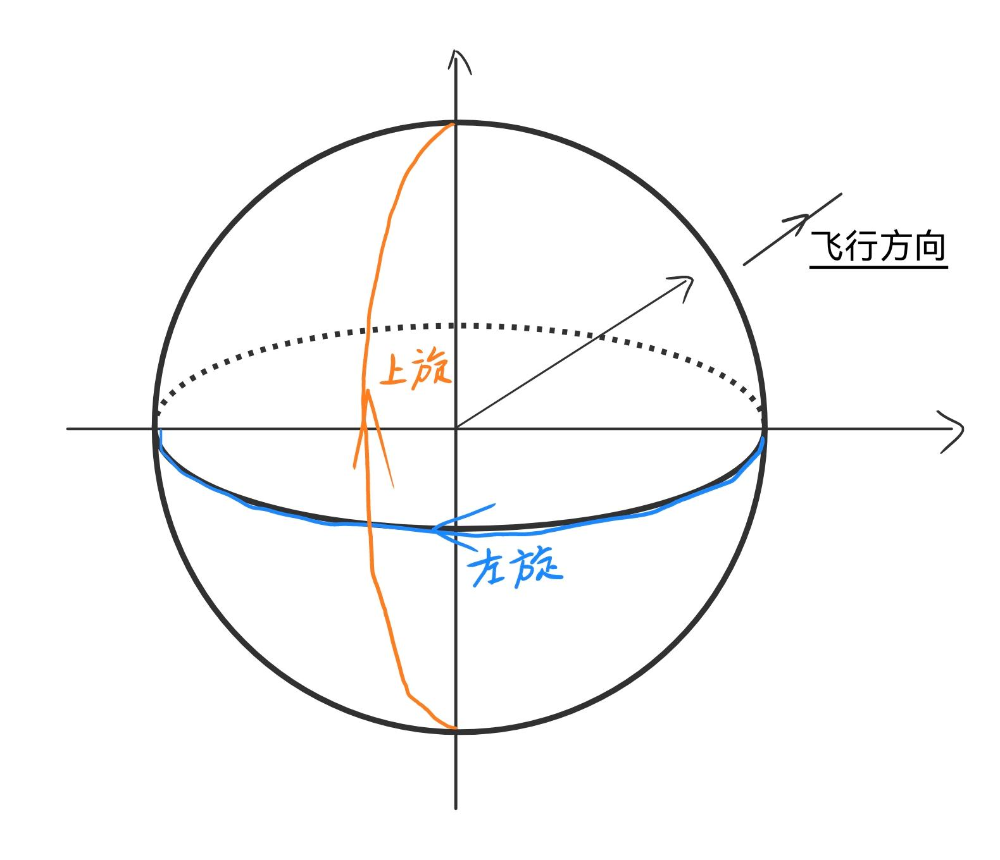

*注*：全篇以横拍双面反胶作为默认打法进行分析
# 旋转
## 旋转的类型
> **简单的定义**：通常是顺着飞行方向或者从击球者到接球者的连线方向，见[图-旋转](乒乓球.md#^0a84af)，观察球的旋转，按上、下、左、右（左右有时也叫顺逆，根据从上往下看的旋转方向确定）进行命名

 ^0a84af

这种定义方式其实忽略了一个旋转的自由度，就是绕着这个观察方向的旋转，比如在放高球（球的运动弧线很大的情况）的时候这种定义就不能清晰展现球的运动。但是在大部分时候这种旋转不容易产生也不容易影响接球（见[旋转的产生](#旋转的产生)），故这里*不做讨论* 
## 旋转的产生
> **击打维持摩擦，摩擦产生旋转** 

## 旋转对轨迹的影响
上旋下落快，弧线高，弹起高度高；下旋下落慢，弧线平，弹起高度低

# 击球
乒乓球击球以从后向前的水平摆动为主要方式，同时有上下的运动（尤其是从下到上）

## 攻球击球点
以上半身（腰以上）平面为基准，手臂在比较自然的范围内向前伸出一些，正手在右前方，反手在左前方。击球点位置的姿势应该保证**发力最顺畅且最灵活**，可以认为是多个控制手臂的肌肉（包括控制大臂、小臂等）最稳定的地方（不存在某个肌肉拉扯非常强，或者说没有拉扯感）。

实际调整可以参考下方[发力](#发力)原理。
### 大致位置
- 手高度：腹部以上胸部以下；
- 大臂与身体侧边夹角：约45~60°；
- 小臂与水平面夹角：约15°，即基本水平可以略微向上；
- 俯视的手臂平面（近似，大小臂不一定在同一个竖直面）和身体平面的夹角：约45°，反手偏大，正手偏小。这个角度比较灵活，比赛时根据人的位置和处理球的选择而变化较大。 #？？？ 

## 发力
与很多运动类似，发力动作可分为**引拍**和**击打**两个部分。所谓“击打”通常是指击球前到击球的一小段瞬间需要一次爆发。越靠近发力末端的地方，可引拍的范围（其实指的是引拍穿过可发力范围需要的时间）越小，同时具有更强的爆发力（可能是每个发力部位的力一级一级传递到末端后叠加出的一个大的力）。

### 发力链条
**腿 → 胯 → 腰 → 大臂 → 小臂 → 手腕**
#### 腿
以**稳定可控的向上的支持力**为主，通常的技术动作不需要腿的姿态有很大的变化（如大小腿站直、膝盖往前顶等，出现这些动作通常是在做大动作发力时的后摇），道理同上，因为变化太大就超出了腿部能稳定提供支持力的范围。腿部姿态变化与转胯相关，在舒适的发力范围内可能略有变化。

#### 胯与腰
> 重心转移带动转胯与转腰     #？？？ 是否与人的身体倾斜有关？

转胯与腿部姿态的变化有关

- 引拍前腰侧肌肉收缩有利于上半身旋转

具体发力机理我目前还不清楚，目前还在找比较好的发力动作

#### 手臂与手腕

## 撞击与摩擦
### 挥拍方向与拍面
由于在挥拍过程中，一些挥拍动作在不同位置的**球拍运动方向**与**拍面方向**变化较快，因此这种情况下击球时刻把握不准确可能会很大程度上影响出球的速度、方向和旋转。
当挥拍方向沿着拍面“切”的时候，所有的挥拍速度都会参与摩擦带来旋转；而随着挥拍方向偏离拍平面，参与摩擦的旋转越来越少，同时出球速度会越来越快。

**因此**，对于一个击球点容错率高的发力动作，动作中拍面角度和挥拍方向不应该发生快速变化，即击球点附近都应该保持拍面角度不怎么变。（对于发力猛的动作，击球点准确度通常要求没有那么高，就是因为动作中拍的姿态和速度几乎不会改变，打不过去是因为击球点偏太多了或者本来选择的拍的角度就不对）

# 练习

主要记录我本人的练习路径
*注*：本人认为移动步伐不需要学习，因为会打羽毛球

1. 简单动作+找球
    - 动作幅度小，先找击球点，并培养用拍找球的意识
2. 撞击与摩擦
    - 通过调整拍面角度、挥拍方向，来感受不同比例的撞击和摩擦；并且可以开始增加动作幅度，开始熟悉如何使用身体各部分的力量
3. 击球时机
    - 调整击球时机（如上升期下降期等），感受不同时机击球对拍面和动作的要求
4. 盯球
    - 尝试“盯球”，在对方球出手时判断球的落点和旋转，并提前移动。找**空间感** 
5. 发力
    - 开始尝试大力量击球

# 典型技术

## 短球
下旋球抢上升期容易卸力，四两拨千斤

## 抢点进攻
抢攻的步伐？击球点？

# 胶皮

## 反胶

## 颗粒

典型特征：**打滑**

# 打法
2025/11/25 我的目前倾向：控制型防守与抢点进攻。就是强调控制，尽可能回球不让对手舒服并且注意自身衔接来达成防守目的，防守中抓机会进攻。
