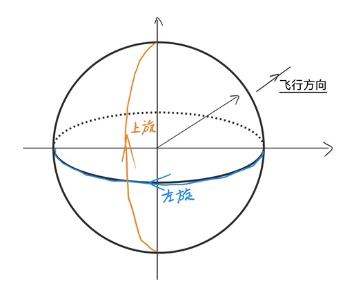
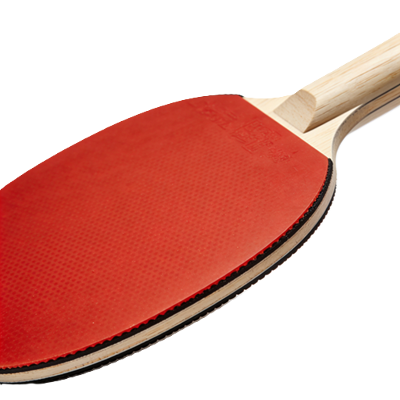
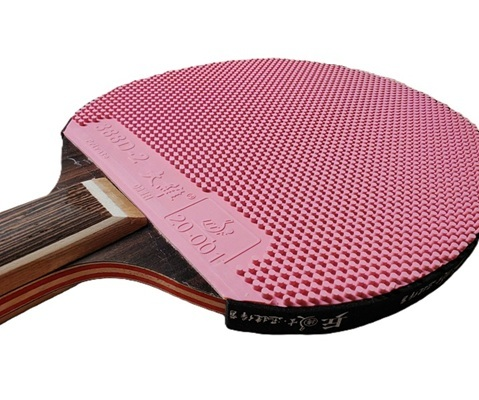

# 乒乓球中的物理原理
在乒乓球运动中，球的*旋转与摩擦*是无法回避的核心议题。正是由于乒乓球独特的旋转特性，才使得它在空中能够划出极富张力的弧线，并在与球拍碰撞和反弹过程中展现出丰富的动态变化。
本文将以笔者个人的思考为基础，借鉴物理竞赛试题的风格，对乒乓球运动中一些*简单而典型*的物理过程进行梳理与总结。

乒乓球运动的基本数据：
- 乒乓球直径 $d=40\text{ mm}$ 
- 乒乓球质量 $m\approx 2.72\text{ g}$ 
- 乒乓球与球桌的恢复系数 $e\approx 0.91$ 
- 乒乓球与球桌的滑动摩擦系数 $\mu \approx 0.2$ 
- 网高 $h = 15.25 \text{ cm}$ 
- 球台长度 $l=2.74\text{ m}$ 
- 球台宽度 $b = 1.525\text{ m}$ 
## 一、旋转
### 1.1 旋转的描述
我们都知道刚体有**三个旋转的自由度**，但乒乓球运动中通常只说**上下旋与左右旋**（顺逆旋），共两个自由度。本节将具体分析这种近似的原因及合理性。
#### 1.1.1 上下旋与左右旋

> 一物理系学生：诶？上下旋我知道！spin up 和 spin down 嘛，上下自旋。
> *笑点解析*：量子力学中电子的自旋有两种本征态（可以简单认为就是两种状态），一种是上自旋一种是下自旋，这个上下是用角动量方向定义的。但是体育运动中几乎不会有人用角速度矢量或者角动量的方向来命名旋转方向……

**我的定义**：
**顺着飞行方向**观察球的旋转，按乒乓球表面的一个点的速度方向进行命名，故有上下左右两个自由度。（*注*：左右有时也叫顺逆，根据从上往下看的旋转方向可以确定）

#### 1.1.2 近似理由与合理性

❓**问题1**：这种近似是否合理？另一个方向的旋转会不会带来什么重要的影响？ 

- 旋转的三种影响：
    1. 空气中的运动轨迹
    2. 球桌上的反弹
    3. 球拍上的反弹
- *注*：可以在看完一、二节后尝试回答。

### 1.2 旋转与轨迹
乒乓球的较强的旋转会大幅影响其在空中的轨迹以及在球桌上的反弹方向。

#### 1.2.1 空气中的轨迹
乒乓球在空中的轨迹受到“**马格努斯效应（Magnus effect）**”的影响，故其弧线变化大。本节主要分析马格努斯效应如何影响乒乓球的运动，以及空气阻力、摩擦阻力是否可以忽略。

##### 1.2.1.1 马格努斯效应
1. **马格努斯效应的定性理解**
    马格努斯效应可以由伯努利原理解释。由于乒乓球的旋转，乒乓球上下的气体流速不同，会导致压强差。
    ❓**问题2**：请定性分析：对于上旋球（定义见[1.1 旋转的描述](#1.1%20旋转的描述)），球是会下落更快还是更慢？
2. **马格努斯效应的定量计算** 
    对于乒乓球，马格努斯力的公式可以近似写为：$$F_{m}=\frac{1}{2}\alpha\rho_{air}\omega rv\cdot \pi r^{2}=\frac{1}{2}\pi\alpha\rho_{air}\omega vr^{3}$$ 其中，$\rho_{air}=1.204 \text{ kg/m³}$ 为空气密度，$r=20\text{ mm}$ 为球半径，$\omega$ 为旋转角速度，$v$ 为球平动速度，$\alpha \approx 0.1$ 为一无量纲常系数。
    ❓**问题3**：考虑乒乓球**弧线低平**（只计算竖直方向的马格努斯力）的情况：网高 $h$ ，球桌边到网的距离为 $a=l/2$ ，出球点离网 $1.5a$ ，高于球桌 $1.5h$ ，初速度水平，大小为 $v$ 。不考虑空气阻力，在上旋角速度恒定为 $\omega$ 的情况下，初速度在什么范围内时可以让球上桌？若是同样角速度的下旋，又是什么范围？（*注：对于高弧线的球，马格努斯效应对落点的实际影响还会比只计算竖直方向的影响更大*）
    ❓**问题4**：与问题3相同的情况，若乒乓球落到对方球桌的中间位置后弹起，恢复系数为 $e$ ，分别计算上旋与下旋情况的最大弹起高度。哪个弹的高？（*注*：球桌的摩擦力不会影响弹起高度）
 ^e00590

##### 1.2.1.2 **空气阻力与摩擦阻力**
（因为我没有数据，所以摩擦阻力直接忽略）

对于空气阻力，在速度较快时可以参考公式 $F_d = \frac{1}{2} ρ_{air} v^{2} C_d \cdot \pi r^{2}$ ，$C_{d}\approx 0.47$ 。显然，当 $\omega r\sim v$ 时，空气阻力与马格努斯力大小接近，不能忽略。

❓**问题5**：在问题3的基础上，加上空气阻力的影响，重新计算上旋球的速度范围。对范围的影响大吗？

#### 球桌上的反弹
球桌与球之间的摩擦很小，因此直接按**经典的滑动摩擦体系**来分析。具有一定旋转的上下旋或左右旋的球在反弹时，常常会有轨迹的突然偏移。接下来计算几个例子来具体分析。

1. ❓**问题6**：搓球为例，下旋角速度 $\omega$ ，出球位置离网 $a/2$ ，高度为 $h$ 。记第一次在球桌上弹起后达到第一个最高点的位置离网 $x$ ，高 $y$ 。忽略除重力外的其它在空中受到的力，怎么样的出球速度 $\vec{v}$ 可以在保证 $y\leq 1.5h$ 的前提下使 $x$ 最小？（*注1*：下旋球的实际的弹起高度要比这样计算的小；*注2：高度越高，水平方向速度变化越大*）
2. 问题（简答）：比如所谓霸王拧，在球桌上反弹时的左右偏移就很大。那么左右旋是否一定会有偏移？

## 二、碰撞与摩擦
本节考虑最经典的反胶与乒乓球的碰撞。

反胶的特点：反胶胶粒朝下（向内）贴在海绵上，表层光滑平整；弹性较好，摩擦能力强，即几乎不与球发生相对滑动。

反胶摩擦的物理机制：……，（以及黏性反胶和涩性反胶区别）

- 问题：碰撞过程是否需要考虑手给拍的恢复力 $kx$ ？给出近似条件
- 问题：击球方向和可能的旋转有没有什么关系？
- 问题：发球可以通过哪些因素判断旋转？
- 问题（未设计好）：出拍方向不变，拍面旋转一定角度之后，对球的轨迹影响多大

- \# （未确定是否添加）：击球时的声音，比如碰撞和摩擦的声音有什么区别
### 2.1 反弹对球的速度和旋转的影响

### 2.2 反胶技术动作

## 三、特殊胶皮之——长胶
长胶是和反胶差异极大的一种胶皮，本节主要分析长胶的击球特点和技术动作。

……
问题：反旋转解释

碰撞较轻情况/碰撞较强情况（完全倒伏）

# 注释
[【1】](#^e00590)马格努斯公式参数来自 Byung Joon Ahn. _Spin Rate and Deflection Ratio of a Ping Pong Ball_, Journal of Science International School Bangkok, 2013, pp. 3, Volume 1 ；$\alpha$ 的数据由DeepSeek使用该文章中的数据计算，且 $\alpha$ 受环境影响较大。转动速度过快时公式不成立。
