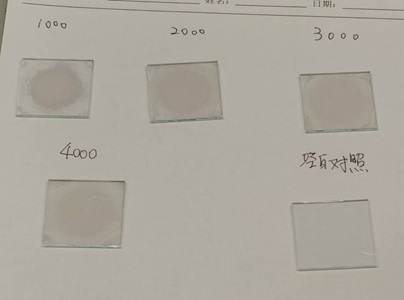

# 实验报告：溶胶-凝胶法制备纳米二氧化钛
实验时间：2025.10.9
实验人：刘简 12312111
## 一、实验目的  
1. 掌握溶胶-凝胶法的基本原理与操作流程  
2. 制备纳米 TiO₂ 薄膜与粉末，理解工艺参数对产物形貌/晶型的影响  
3. 学会用丁达尔现象、XRD、AFM/TEM 等手段表征溶胶及纳米 TiO₂

## 二、实验原理
1. 溶胶-凝胶法  
    用含高化学活性组分的化合物作前驱体，经水解-缩聚形成溶胶，再经热处理得氧化物纳米材料。  
    主要反应：  
    $$
    \begin{align}
     \text{水解： } & \ce{Ti(OR)4 + 4H2O -> Ti(OH)4 + 4ROH} \\
     \text{失醇缩聚： }  & \ce{-Ti-OR + HO-Ti- -> -Ti-O-Ti- + ROH}\\
     \text{失水缩聚： } & \ce{-Ti-OH + HO-Ti- -> -Ti-O-Ti- + H2O}
    \end{align}
    $$

2. 纳米二氧化钛制备
    - 前驱体：钛酸异丙酯 Ti(OCH(CH₃)₂)₄（TTIP）
    - 溶剂：无水乙醇（C₂H₅OH）
    - 抑制剂：盐酸（HCl，4.8 mol·L⁻¹），用于延缓剧烈水解，防止快速沉淀

3. **表征原理**  
    - **胶体鉴定**：丁达尔效应
        胶体粒子直径 1–100 nm，可见光（400–700 nm）发生散射，出现明亮“光路”；溶液粒子太小时散射弱，悬浊液粒子太大以反射为主。
    - **晶体结构确定**：X 射线衍射（XRD）
        依据布拉格方程 2d sinθ = nλ 及 Scherrer 公式 D = Kλ/(βcosθ) 计算晶粒尺寸并判定锐钛矿/金红石相。
    - 表**面形貌及粒径半径确定**：原子力显微镜（AFM）或透射电子显微镜（TEM）
        原子力显微镜（AFM）探针扫描获得三维表面轮廓，横向分辨率<1 nm，纵向<0.1 nm；
        透射电子显微镜（TEM）直接观察颗粒形貌并选区衍射确认晶型。

## 三、实验器材与试剂  
- **试剂**：钛酸异丙酯（TTIP，≥97 %）、无水乙醇、浓盐酸（37 %）、去离子水；  
- **器材/仪器**：磁力搅拌器、恒压滴液漏斗、玻璃基片、旋涂仪、马弗炉、离心机、激光笔（丁达尔测试）、XRD、AFM。

## 四、实验内容  
1. **溶胶配制**  
    1. 20 mL 无水乙醇置于洁净烧杯，剧烈搅拌；  
    2. 配制 4.8 mol·L⁻¹ HCl，取 1 mL 缓慢滴入乙醇，持续搅拌 2 h；  
    3. 取 1 mL TTIP 缓慢滴入上述混合液，继续剧烈搅拌 1 h，得淡黄色透明溶胶。  

2. **基片预处理**  
   玻璃片依次用去离子水、乙醇超声清洗 10 min，干燥。  

3. **薄膜制备**（旋涂-退火）  
   取 0.5 mL 溶胶滴至基片，分别用 1000、2000、3000、4000 rpm 旋涂 30 s；  
   低温退火：200 °C 热板 20 min；  
   高温退火：马弗炉 500 °C 保温 45 min，随炉冷却，得纳米 TiO₂ 薄膜。  

## 五、实验数据
- **旋涂效果**：
    
## 六、实验结果  
1. **丁达尔现象**  
   用激光笔照射溶胶，可观察到激光光线，证明胶体粒子存在。 
    

3. 影响因素：……暂略

## 七、思考题解答  
1. 实验中对纳米二氧化钛的生成有哪些影响因素？  
    ……
2. 如何测得实验中所制备的纳米二氧化钛薄膜的厚度？
    ……