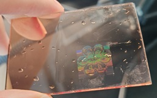

# 实验报告：激光干涉阵列扫描实验
实验时间：2025.10.16
实验人：刘简 12312111
## 一、实验目的
- 通过本实验对点矩阵全息图的形成和应用有所了解
- 了解电动光学平台的原理、应用与使用方法
## 二、实验原理
1. 全息原理
    ……

## 三、实验内容
1. 调节光路
    ……
2. 设置自动化程序
    ……
3. 显影

## 四、实验结果
**显影效果**：

