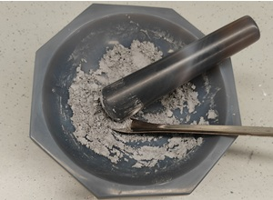
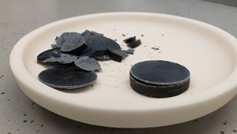

# 实验报告：高温超导材料 YBCO 的制备及表征
实验时间：2025.9.25
实验人：刘简 12312111

---
## 一、实验目的
1. 熟悉 $\mathrm{YBa_{2}Cu_{3}O_{7-\delta}}$ 超导材料的制备流程  
2. 了解超导体的基本性能（零电阻、迈斯纳效应）  
3. 掌握四探针法测量超导转变温度 Tc 的实验技术

---
## 二、实验原理
### 超导基本特性
1. **零电阻现象**
    当温度降至临界温度 Tc 以下时，材料电阻突然降为零：
    $$ R(T \le T_c) = 0 $$

2. **完全抗磁性**（迈斯纳效应）
    超导体在 T < Tc 时把内部磁感应强度完全排斥：
    $$ \mathbf{B} = 0 \quad (\text{inside bulk superconductor}) $$

> 迈斯纳效应与零电阻共同构成超导态的判据。

---
## 三、实验内容
### 1. 样品制备
制备：**0.01mol** $\mathrm{YBa_{2}Cu_{3}O_{7-\delta}}$ 

1. **称量**：按化学计量比计算并精确称取 Y₂O₃、BaCO₃、CuO 。
    质量理论值：1.12905g Y₂O₃ ，3.9468g BaCO₃ ，2.3865g CuO 。
2. **研磨**：混合研磨 2 h，至无明显色差、手感均匀。可使用酒精等不反应的液体辅助研磨。
3. **压片**：通过压片机将粉末压制成厚 ≈ 1.5 mm 的圆片，大约压 5 min。
4. **煅烧**：升温/保温/降温程序：$$ 50\,\celsius \xrightarrow{150\,\mathrm{min}} 930\,\celsius \xrightarrow{1800\,\mathrm{min}} 930\,\celsius \xrightarrow{600\,\mathrm{min}} 350\,\celsius \rightarrow \text{室温} $$ 

### 2. 迈斯纳效应快速检测
将样品置于小盒，倒入液氮（77 K）完全浸没；取小块永磁体置于样品正上方。若磁铁悬浮，则初步确认超导态形成。

### 3. （可选）超导转变温度测定
采用四探针法测量 V-T 曲线，记录电阻开始陡降的温度 $T_{c,onset}$ 与电阻降至 0 µV 对应的 $T_{c,zero}$ ：
$$ T_c = \frac{T_{\text{onset}} + T_{\text{zero}}}{2} $$

### 注意事项：
- 注意清洗工具，避免污染样品
- 称量轻拿轻放，避免原料损失
- 研磨时防止粉末飞溅
- 压片前确认模具放气完成，禁止伸手触碰
- 液氮温度 77 K，操作时戴防冻手套，避免直接接触皮肤
---
## 四、实验数据
1. 称量
    <table>
        <thead>
            <tr>
                <th></th>
                <th>理论值/g</th>
                <th>测量值/g</th>
            </tr>
        </thead>
        <tbody>
            <tr>
                <td>Y₂O₃</td>
                <td>1.12905</td>
                <td>1.1295</td>
            </tr>
            <tr>
                <td>BaCO₃</td>
                <td>3.9468</td>
                <td>3.9473</td>
            </tr>
            <tr>
                <td>CuO</td>
                <td>2.3865</td>
                <td>2.3867</td>
            </tr>
        </tbody>
    </table>
2. 研磨效果
    
3. 压片效果
    

---
## 五、实验结果
……

---
## 六、思考题
1. **研磨的目的是什么？研磨是否均匀判断标准是什么？**  
   目的：使原料均匀混合，促进固相反应形成超导。
   判断：粉末颜色均一、无颗粒感。

2. **缓慢降温对超导特性有何影响？**  
   缓慢降温有利于氧原子有序进入晶格，提高 Cu-O 链完整度，从而增高载流子浓度与 Tc。

3. **相对于两探针法，使用四探针法测量超导的 V-T 曲线有何好处？**  
   在测量小电阻时避免引线电阻与接触电阻的影响，测量精度高。
