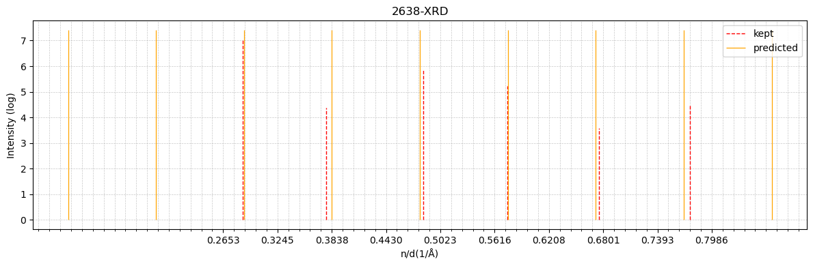
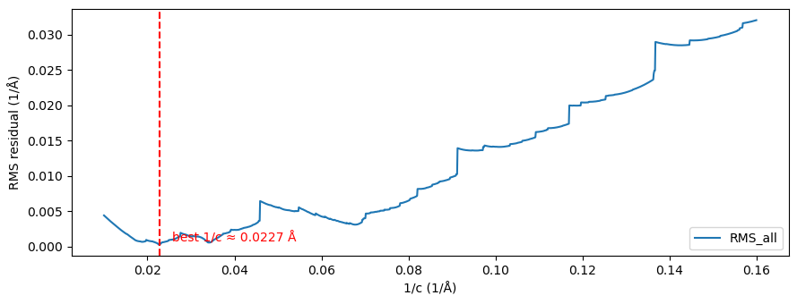
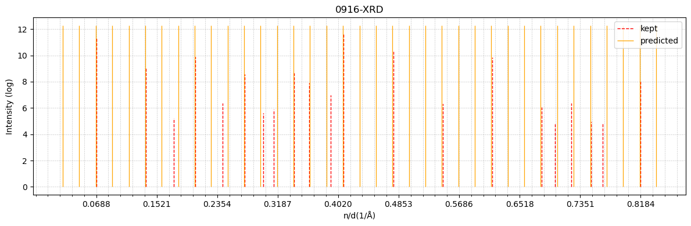
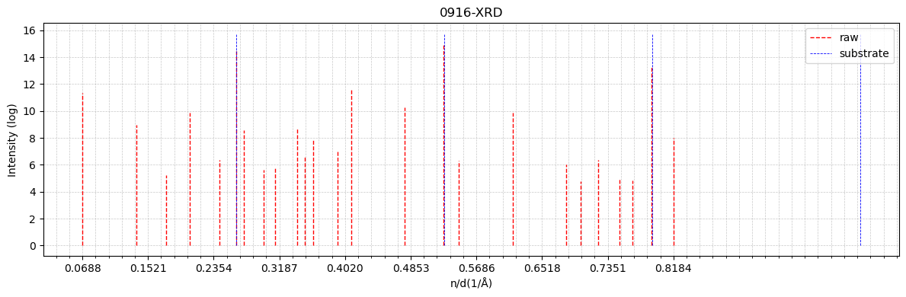
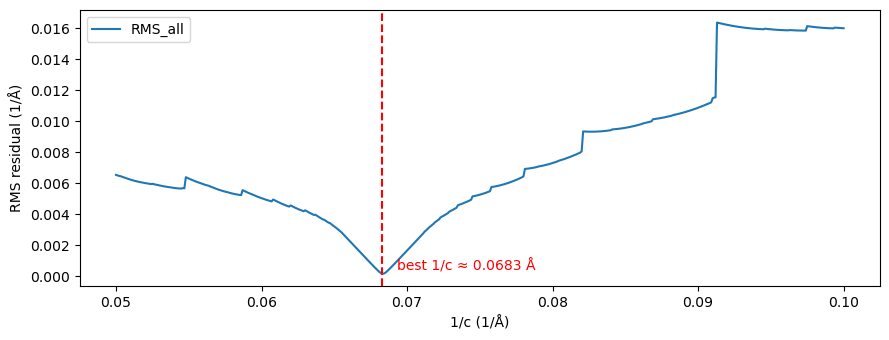

```python
# import import_ipynb
import xrd
import numpy as np
import copy

lam=1.54184 # Cu Kα
d_NdAlO3_001 = 3.75
d_LaAlO3_001 = 3.79

def show_result(inst:xrd.XRDData):
    print('原始数据与峰:')
    inst.show_raw_data(with_peaks=True)
    print('---------------------------------------------------')
    print('所有峰和衬底峰：')
    inst.show_peaks(raw=True,sub=True)
    print('---------------------------------------------------')
    print('1/c 拟合：')
    inst.show_RMS_cinv()
    print('---------------------------------------------------')
    print('筛选后的峰和预测峰：')
    inst.show_peaks(filtered=True, predicted=True)
    print('---------------------------------------------------')
    print(f'c({inst.name})={1/inst.best_cinv}')
```


```python
xrd2638=xrd.XRDData('2638-XRD',np.loadtxt("2638-XRD.txt"),lam,d_NdAlO3_001)

xrd2638.set_peak_calc_param()
xrd2638.calc_peaks()
xrd2638.erase_peak(3,-3)
xrd2638.calc_peaks()

xrd2638.change_2theta_to_ndinv()
xrd2638.remove_substrate_peaks(tol=0.005)
xrd2638.calc_residual_for_cinv(cinv_range=None, step=0.0001)
xrd2638.calc_best_cinv((0.08,0.11))
xrd2638.filter_with_best_cinv(tol=0.02)
xrd2638.calc_residual_for_cinv(cinv_range=(0.05,0.16), step=0.0001)
```

    Peak calculation parameters updated:
      prominence : 30
      rel_height : 0.5
      width      : 1.0
      distance   : 40
    Peak calculation parameters:
      prominence : 30
      rel_height : 0.5
      width      : 1.0
      distance   : 40
    [23.6  25.52 34.92 43.76 46.36 48.44 52.64 62.4  73.36 76.  ]
    Peak calculation parameters:
      prominence : 30
      rel_height : 0.5
      width      : 1.0
      distance   : 40
    [23.6  25.52 33.88 43.76 46.36 48.44 52.64 62.8  73.36 76.  ]
    Use 1/c range:(np.float64(0.013592307198315945), np.float64(0.2718461439663189))
    


```python
xrd2636=xrd.XRDData('2636-XRD',np.loadtxt("2636-XRD.txt"),lam,d_NdAlO3_001)

xrd2636.set_peak_calc_param(prominence=70,distance=150)
xrd2636.calc_peaks()
xrd2636.remove_peak(1)

xrd2636.change_2theta_to_ndinv()
xrd2636.remove_substrate_peaks(tol=0.005)
xrd2636.calc_residual_for_cinv(cinv_range=(0.0001,0.4), step=0.0001)
xrd2636.calc_best_cinv((0.09,0.11))
```

    Peak calculation parameters updated:
      prominence : 70
      rel_height : 0.5
      width      : 1.0
      distance   : 150
    Peak calculation parameters:
      prominence : 70
      rel_height : 0.5
      width      : 1.0
      distance   : 150
    [ 0.9  23.62 44.4  48.44 51.72 73.   76.  ]
    


```python
xrd0916=xrd.XRDData('0916-XRD',np.loadtxt("0916-XRD.txt"),lam,d_LaAlO3_001)

xrd0916.set_peak_calc_param(prominence=100,distance=20)
xrd0916.calc_peaks()
xrd0916.remove_peak(1,9,12,13,14,19,21)

xrd0916.change_2theta_to_ndinv()
xrd0916.remove_substrate_peaks(tol=0.005)
xrd0916.calc_residual_for_cinv(cinv_range=None, step=0.0001)
xrd0916.filter_with_best_cinv(tol=0.01)
xrd0916.calc_residual_for_cinv(cinv_range=(0.01,0.16), step=0.0001)

xrd0916_2 = copy.deepcopy(xrd0916)
xrd0916_2.calc_best_cinv((0.06,0.08))
xrd0916_2.filter_with_best_cinv(0.01)
xrd0916_2.calc_residual_for_cinv((0.05,0.1))
```

    Peak calculation parameters updated:
      prominence : 100
      rel_height : 0.5
      width      : 1.0
      distance   : 20
    Peak calculation parameters:
      prominence : 100
      rel_height : 0.5
      width      : 1.0
      distance   : 20
    [ 0.28  6.08 12.12 15.54 18.2  21.58 23.48 24.32 25.96 26.66 27.96 28.6
     29.54 29.98 30.48 31.38 32.38 35.18 35.94 36.8  38.14 43.22 47.94 49.82
     56.54 63.5  65.36 67.78 70.7  72.4  75.12 78.24]
    Use 1/c range:(np.float64(0.004909456979877963), np.float64(0.09818913959755926))
    


```python
print('=================================================================')
show_result(xrd2638)
```

    =================================================================
    原始数据与峰:
    


    

    


    ---------------------------------------------------
    所有峰和衬底峰：
    


    

    


    ---------------------------------------------------
    1/c 拟合：
    


    

    


    ---------------------------------------------------
    筛选后的峰和预测峰：
    


    

    


    ---------------------------------------------------
    c(2638-XRD)=10.416666666666524
    


```python
print('=================================================================')
show_result(xrd2636)
```

    =================================================================
    原始数据与峰:
    


    

    


    ---------------------------------------------------
    所有峰和衬底峰：
    


    

    


    ---------------------------------------------------
    1/c 拟合：
    


    

    


    ---------------------------------------------------
    筛选后的峰和预测峰：
    


    

    


    ---------------------------------------------------
    c(2636-XRD)=10.362694300518134
    


```python
print('=================================================================')
show_result(xrd0916)
print('=================================================================')
show_result(xrd0916_2)
```

    =================================================================
    原始数据与峰:


    


    ---------------------------------------------------
    所有峰和衬底峰：
    


    

    


    ---------------------------------------------------
    1/c 拟合：
    


    

    


    ---------------------------------------------------
    筛选后的峰和预测峰：
    


    

    


    ---------------------------------------------------
    c(0916-XRD)=44.0528634361235
    =================================================================
    原始数据与峰:
    


    

    


    ---------------------------------------------------
    所有峰和衬底峰：
    


    

    


    ---------------------------------------------------
    1/c 拟合：
    


    

    


    ---------------------------------------------------
    筛选后的峰和预测峰：
    


    

    


    ---------------------------------------------------
    c(0916-XRD)=14.641288433382025
    
