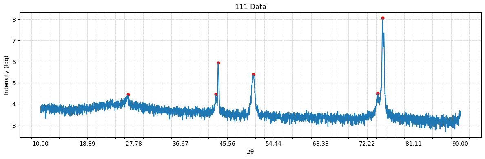
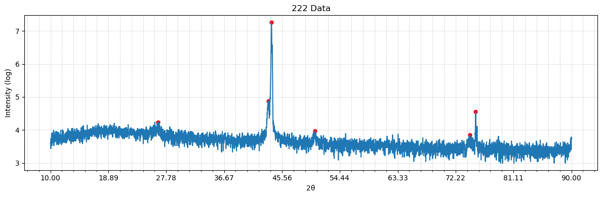

```python
# import import_ipynb
import xrd
import numpy as np
import copy

lam = 1.5418    # Cu Kα
d = 0.00001     # 忽略衬底

def show_result(inst:xrd.XRDData):
    print('===================================================')
    print(inst.name,'原始数据与峰:')
    inst.show_raw_data(with_peaks=True)
    print('---------------------------------------------------')
    print(inst.name,"peaks(2θ):",inst.peaks_2theta)

def print_peaks(name,peaks:np.ndarray,name_len=24,data_len=9,with_title=False):
    if with_title:
        print(f"{'':<{name_len}}", end="")
        for i in range(len(peaks)):
            print(f"{f'Peak{i+1}':<{data_len}}", end="")
        print()
    print(f"{name:<{name_len}}", end="")
    for val in peaks:
        print(f"{val:<{data_len}.2f}", end="")
    print()
```


```python
xrd111=xrd.XRDData('111 Data',np.loadtxt("111_Theta_2-Theta.txt"),lam,d)

xrd111.set_peak_calc_param()
xrd111.calc_peaks()
xrd111.remove_peak(1)
# xrd111.show_raw_data(with_peaks=True)

xrd111.change_2theta_to_ndinv()
# xrd111.show_peaks(raw=True)
```

    Peak calculation parameters updated:
      prominence : 30
      rel_height : 0.5
      width      : 1.0
      distance   : 40
    Peak calculation parameters:
      prominence : 30
      rel_height : 0.5
      width      : 1.0
      distance   : 40
    [23.34 26.66 43.35 43.83 50.55 74.24 75.19]
    


```python
xrd222=xrd.XRDData('222 Data',np.loadtxt("222_Theta_2-Theta.txt"),lam,d)

xrd222.set_peak_calc_param()
xrd222.calc_peaks()
xrd222.remove_peak(1,2)
xrd222.add_peak_near_x(50,tol=1)
xrd222.add_peak_near_x(74,tol=1)
# xrd222.show_raw_data(with_peaks=True)

xrd222.change_2theta_to_ndinv()
# xrd222.show_peaks(raw=True)
```

    Peak calculation parameters updated:
      prominence : 30
      rel_height : 0.5
      width      : 1.0
      distance   : 40
    Peak calculation parameters:
      prominence : 30
      rel_height : 0.5
      width      : 1.0
      distance   : 40
    [19.81 26.03 26.5  43.48 43.94 75.3 ]
    


```python
show_result(xrd111)
show_result(xrd222)
print('===================================================')
peaks_num=len(xrd111.peaks_2theta)
print(f"显然峰一一对应，共{peaks_num}个峰。取平均：")
peaks = (xrd111.peaks_2theta + xrd222.peaks_2theta)/2

print_peaks(xrd111.name+" peaks(2θ):",xrd111.peaks_2theta,with_title=True)
print_peaks(xrd222.name+" peaks(2θ):",xrd222.peaks_2theta)
print_peaks("average peaks(2θ):",peaks)
```

    ===================================================
    111 Data 原始数据与峰:
    


    

    


    ---------------------------------------------------
    111 Data peaks(2θ): [26.66 43.35 43.83 50.55 74.24 75.19]
    ===================================================
    222 Data 原始数据与峰:
    


    

    


    ---------------------------------------------------
    222 Data peaks(2θ): [26.5  43.48 43.94 50.63 74.4  75.3 ]
    ===================================================
    显然峰一一对应，共6个峰。取平均：
                            Peak1    Peak2    Peak3    Peak4    Peak5    Peak6  
    111 Data peaks(2θ):     26.66    43.35    43.83    50.55    74.24    75.19    
    222 Data peaks(2θ):     26.50    43.48    43.94    50.63    74.40    75.30    
    average peaks(2θ):      26.58    43.41    43.88    50.59    74.32    75.25    
    


```python

```
