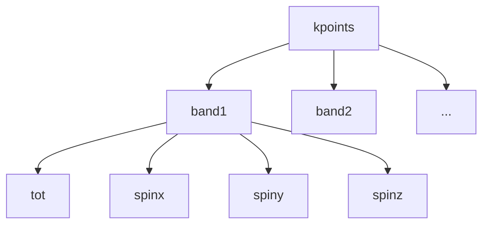

$$
\rho(\mathbf{r}) = \sum_{\ell=0}^{\text{LMAXMIX}} \sum_{m=-\ell}^{\ell} \rho_{\ell m}(r) Y_{\ell m}(\theta,\phi)
$$
$$
\begin{align}
 & H\psi_{i}=E_{i}\psi_{i} \\
 & P_{g}\psi_{i}=\sum A_{ji}^{\alpha}\psi_{j} \\
 & H\cdot left: HP_{g}\psi_{i}=E_{i}P_{g}\psi_{i}=E_{i}\sum A_{ji}^{\alpha}\psi_{j} \\
 & H\cdot right:H\sum A_{ji}^{\alpha}\psi_{j}=\sum A_{ji}^{\alpha}E_{j}\psi_{j} \\
 & \implies \text{if }A_{ji}\neq 0\text{, } E_{j}=E_{i}
\end{align}
$$
$$
\begin{align}
 & P_{g}\psi_{k}^{\alpha}=\sum_{\beta} c_{\beta\alpha}\psi_{Rk}^{\beta} \\
 & HP_{g}\psi_{k}^{\alpha}=\sum_{\beta} c_{\beta\alpha}E_{Rk}^{\beta}\psi_{Rk}^{\beta}=P_{g}H\psi_{k}^{\alpha}=E_{k}^{\alpha}\sum_{\beta} c_{\beta\alpha}\psi_{Rk}^{\beta} \\
 & \implies E_{k}^{\alpha}= E_{Rk}^{\beta}\text{ , for }c_{\beta\alpha}\neq 0 \\
 \\
 & \psi_{k}=\sum c_{\alpha}\psi_{k}^{\alpha}: \\
 & \implies \sum_{\alpha,\beta}c_{\alpha}c_{\beta\alpha}E_{Rk}^{\beta}\psi_{Rk}^{\beta}=\sum_{\alpha,\beta}c_{\alpha}c_{\beta\alpha}E_{k}^{\alpha}\psi_{Rk}^{\beta} \text{ , for }\forall c_{\alpha} \\
 & \implies E_{k}^{\alpha}= E_{Rk}^{\beta}\text{ , for }c_{\beta\alpha}\neq 0\text{ , for }\forall \alpha
\end{align}
$$

